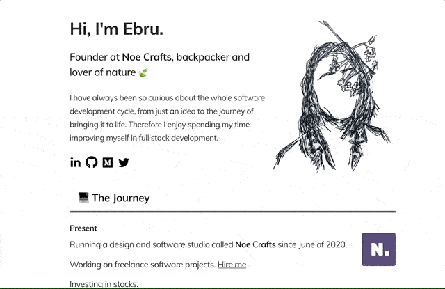

# ebrukaya.me 

This is my personal website. I'm adding new sections along the way of the journey of growing both professionally and personally.

## updates
#### Nov '19
- Switched to **Gatsby** using automatic deployment with Netlify.

#### Sept '19
- **v2** has been released with a minimal design.

#### Jul '19
- Page rendering has been changed dynamically as getting data from a json file.
- **Deployment** has been automated through cPanel while fetching from Github repo directly.

#### May '19
- **Docker** has been added to tech stack.