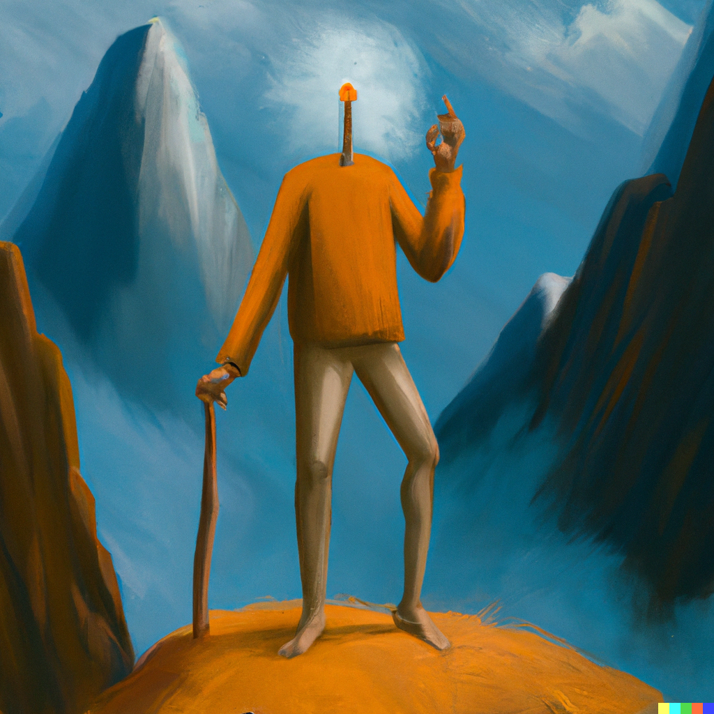

 

I asked **<a href='https://openai.com/dall-e-2/' target='_blank'>DALL·E</a>** to draw me an image for this post saying `optimist nihilist enjoying life in mountains, digital art` and did an amazing job as always! I've recently got my invitation there and it amazes me more each day.

Today I was feeling a little bit overwhelmed mentally and investigating the idea of nothing matters but actually anything can matter for you, *aka. optimistic nihilism.* I was an advocater of this idea for a while actually but I realized that I never watched **<a href='https://youtu.be/MBRqu0YOH14' target='_blank'>this video</a>** itself from Kurzgesagt.

I loved it! and cannot be more in love with it's poetic side as well.

---

``Human existence is scary and confusing.
A few hundred thousand years ago, we became conscious and found ourselves in a strange place.
It was filled with other beings. We could eat some; some could eat us.
There was liquid stuff we could drink; things we could use to make more things.
The daytime sky had a tiny yellow ball that warmed our skin.
The night sky was filled with beautiful lights.
This place was obviously made for us.
Something was watching over us.
We were home. 

This made everything much less scary and confusing.
But the older we got, the more we learned about the world and ourselves.

We learned that the twinkling lights are not shining beautifully for us, they just are.
We learned that we're not at the center of what we now call the universe, and that it is much, much older than we thought.
We learned that we're made of many little dead things, which make up bigger things that are not dead, for some reason, and that we're just another temporary stage in a history going back over a billion years.
We learned, in awe, that we live on a moist speck of dust moving around a medium-sized star in a quiet region of one arm of an average galaxy, which is part of a galaxy group that we will never leave.
And this group is only one of thousands that, together, make up a galaxy supercluster.
But even our supercluster is only one in thousands that make up what we call the observable universe. The universe might be a million times bigger, but we will never know.

We can throw words around like two hundred million galaxies or trillions of stars or bazillions of planets, but all of these numbers mean nothing. Our brains can't comprehend these concepts.
The universe is too big. There is too much of it. But size is not the most troubling concept we have to deal with: It's time, or, more precisely, the time we have.
If you're lucky enough to live to one hundred, you have five thousand two hundred weeks at your disposal.
If you're twenty-five now, then you have three thousand nine hundred weeks left.
If you're going to die at seventy, then there are two thousand three hundred and forty weeks left - a lot of time, but also ... not really.

And then what?
Your biological processes will break down, and the dynamic pattern that is you will stop being dynamic.
It will dissolve until there is no you left.
Some believe that there is a part of us we can't see or measure, but we have no way to find out, so this life might be it and we might end up dead forever.

This is less scary than it sounds, though.
If you don't remember the 13.75 billion years that went by before you existed,
Then the trillions and trillions and trillions of years that come after will pass in no time once you're gone.
Close your eyes. Count to 1. That's how long forever feels.
And as far as we know, in the end, the universe itself will die and nothing will ever change again.

Our videos induce existential dread in many people, and the last few minutes probably haven't helped. So, for once, we want to offer a different way of looking at these things: an unscientific, subjective point of view, the philosophy of Kurzgesagt, if you want.
Please take it with a grain of salt; we don't know any more about human existence than you do.

We counter existential dread with optimistic nihilism.
What do we mean by that?

Well, to summarize, it seems very unlikely that 200 trillion trillion stars have been made for us.
In a way, it feels like the cruelest joke in existence has been played on us.
We became self-aware only to realize this story is not about us.
While it is great to know about electrons and the powerhouse of the cell,
Science doesn't do a lot to make this less depressing.
Okay, but so what?

You only get one shot at life, which is scary, but it also sets you free.
If the universe ends in heat death, every humiliation you suffer in your life will be forgotten.
Every mistake you made will not matter in the end.
Every bad thing you did will be voided.
If our life is all we get to experience, then it's the only thing that matters.
If the universe has no principles, the only principles relevant are the ones we decide on.
If the universe has no purpose, then we get to dictate what its purpose is.

Humans will most certainly cease to exist at some point, but before we do, we get to explore ourselves and the world around us.
We get to experience feelings. We get to experience food, books, sunrises, and being with each other.
The fact that we're even able to think about these things is already kind of incredible.
It's easy to think of ourselves as separated from everything, but this is not true.
We are as much the universe as a neutron star or a black hole or a nebula.
Even better, actually, we are its thinking and feeling part: the centre organs of the universe.

We are truly free in a universe-sized playground, so we might as well aim to be happy and to build some kind of utopia in the stars.
It's not as if we've found out everything there is to know
We don't know why the rules of the universe are as they are, how life came into existence, what life is.
We have no idea what consciousness is or if we are alone in the universe.
But we can try to find some answers.

There are billions of stars to visit, diseases to cure, people to help, happy feelings to be experienced, and video games to finish. There is so much to do.
So, wrapping up, you've probably used up a good chunk of the time available to you.
If this is our one shot at life, there is no reason not to have fun and live as happy as possible.
Bonus points if you made the life of other people better.
More bonus points if you help build a galactic human empire.

Do the things that make you feel good.
You get to decide whatever this means for you.``